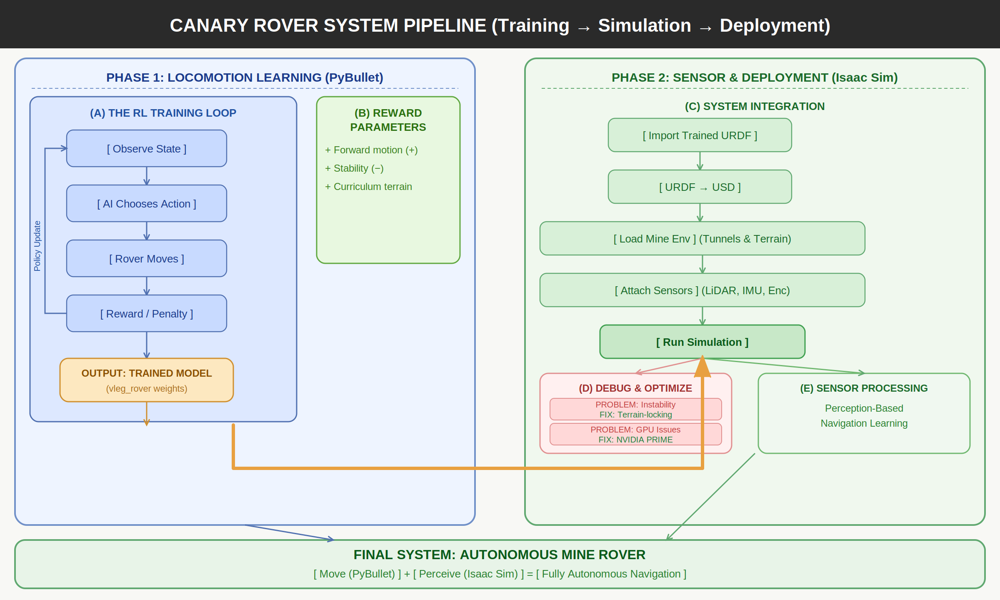

# The Canary Rover

**Autonomous Mobile Scout for Pre-Entry Hazardous Mine Inspection**  
Mechanical Engineering Capstone Project — Thapar Institute of Engineering & Technology

---

## System Pipeline



---

## Repository Structure

| Folder | Contents |
|--------|---------|
| `canary_rover_ws/` | ROS2 simulation — IMU, LiDAR and encoder sensor nodes |
| `pybullet_rl/` | Reinforcement learning — rover locomotion training in PyBullet |
| `isaac_sim_demo/` | NVIDIA Isaac Sim 5.1.0 — full 3D visual simulation with live sensors |

---

## Phase 1 — Reinforcement Learning (`pybullet_rl/`)

The rover learns to drive autonomously through a 60m mine tunnel using **Proximal Policy Optimization (PPO)**.

| File | Purpose |
|------|---------|
| `rover_env.py` | Custom Gymnasium environment — tunnel, terrain, reward shaping |
| `train.py` | PPO training script using Stable-Baselines3 |
| `rover_model.zip` | Pre-trained model weights (200,000 timesteps) |
| `vleg_rover.urdf` | V-Leg rover robot description |

**Environment details:**
- Action space: 2D continuous (left torque, right torque)
- Observation space: 8D — position, roll, pitch, linear velocity, angular velocity
- Reward: forward progress × 3 + velocity bonus − tilt penalty − time penalty
- Episode terminates at finish line (x = 55m) or tip-over (|roll| or |pitch| > 1.2 rad)

**Training:**
```bash
cd pybullet_rl
pip install stable-baselines3 pybullet gymnasium
python train.py
```

---

## Phase 2 — Sensor Simulation (`canary_rover_ws/`)

Three ROS2 nodes simulate the physical sensors fitted on the rover:

| Node | Sensor | Publish Rate |
|------|--------|-------------|
| `imu_sim.py` | MPU6050 IMU — pitch, roll, slope | 50 Hz |
| `lidar_sim.py` | RPLiDAR A1M8 — 360° wall distances | 10 Hz |
| `motor_encoder_sim.py` | 4× BLDC encoders — RPM, speed, ticks | 50 Hz |

**Run:**
```bash
cd canary_rover_ws
source /opt/ros/humble/setup.bash
colcon build --packages-select canary_rover_sim
source install/setup.bash
ros2 launch canary_rover_sim full_sim.launch.py
```

---

## Phase 3 — Visual Simulation (`isaac_sim_demo/`)

Full 3D visual simulation in NVIDIA Isaac Sim 5.1.0 — rover drives through the tunnel with all sensors live.

**Run:**
```bash
cd ~/isaac
./python.sh ~/Desktop/Kunal_Personal/Capstone/isaac_sim_demo/canary_demo.py
```

---

## Contributors

| Name | GitHub |
|------|--------|
| Kunal Somani | [Kunal-Somani](https://github.com/Kunal-Somani) |
| Ujjwal | [ujjwx1](https://github.com/ujjwx1) |
| Chhavi | [Chhavi223](https://github.com/Chhavi223) |
