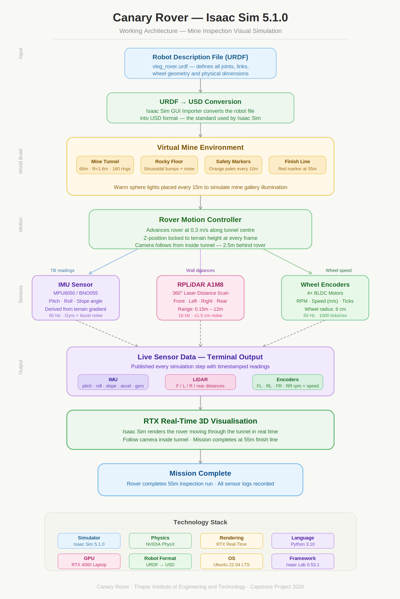

# Isaac Sim Demo — Canary Rover Visual Simulation

**NVIDIA Isaac Sim 5.1.0 | Canary Rover Capstone Project**  
Thapar Institute of Engineering & Technology

---

## What This Is

A full 3D visual simulation of the Canary Rover driving autonomously through a 60m underground mine tunnel, with live sensor data streaming in the terminal.

This upgrades the previous ROS2 text-only simulation to a complete **visual working demo** in NVIDIA Isaac Sim.

---

## Demo Preview



---

## Files

| File | Purpose |
|------|---------|
| `canary_demo.py` | Main demo — rover drives through tunnel with live sensors |
| `static_pose.py` | Static scene for screenshots at any tunnel position |
| `vleg_rover.urdf` | V-Leg Rover robot description file |
| `robot/` | Converted USD robot asset for Isaac Sim |

---

## How to Run

**Prerequisites:**
- NVIDIA Isaac Sim 5.1.0 installed at `~/isaac/`
- GPU in NVIDIA PRIME mode (`sudo prime-select nvidia`)

**Main demo:**
```bash
cd ~/isaac
./python.sh ~/Desktop/Kunal_Personal/Capstone/isaac_sim_demo/canary_demo.py
```

**Static pose for screenshots:**
```bash
./python.sh ~/Desktop/Kunal_Personal/Capstone/isaac_sim_demo/static_pose.py
```

---

## World Environment

| Feature | Details |
|---------|---------|
| Tunnel | Cylindrical mesh, 60m long, 1.6m radius, 160 segments |
| Floor | Rocky sinusoidal terrain with scattered boulders |
| Lighting | Warm sphere lights every 15m (mine atmosphere) |
| Hazard markers | Orange poles every 10m |
| Finish line | Red marker at 55m |

---

## Sensors Simulated

### IMU — MPU6050 / BNO055 (50 Hz)
- Pitch and roll computed from **actual terrain slope** at each position
- Accelerometer and gyroscope with realistic noise (matched to datasheet)
- Slope angle output for incline detection

### RPLiDAR A1M8 (10 Hz)
- 360° scan, range 0.15–12m
- Wall distance measurement against tunnel geometry
- Obstacle detection simulation

### 4× BLDC Wheel Encoders (50 Hz)
- 1000 ticks/revolution
- Wheel radius 6cm
- RPM and linear speed per wheel

---

## Upgrade from ROS2 Simulation

| Feature | ROS2 (previous) | Isaac Sim (this) |
|---------|-----------------|-----------------|
| Visual | None — terminal only | Full 3D RTX render |
| Physics | Fake math | Real physics engine |
| Terrain | Simulated in code | Actual mesh geometry |
| Sensors | Scripted fake data | Physics-derived readings |
| Camera | None | Follow cam inside tunnel |

---

## Development Journey

See `canary_rover_architecture.png` for the complete step-by-step workflow
of how this simulation was built from scratch in one session.
